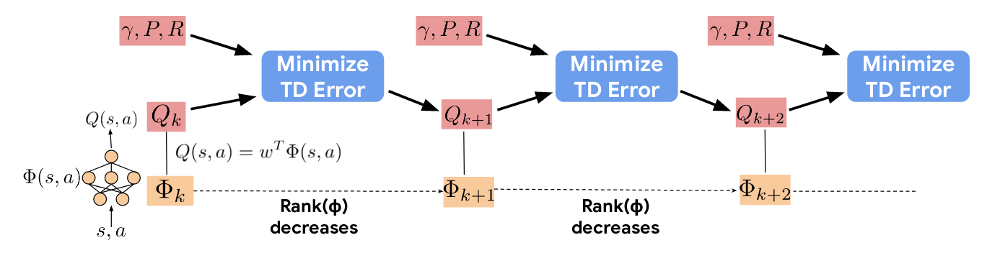
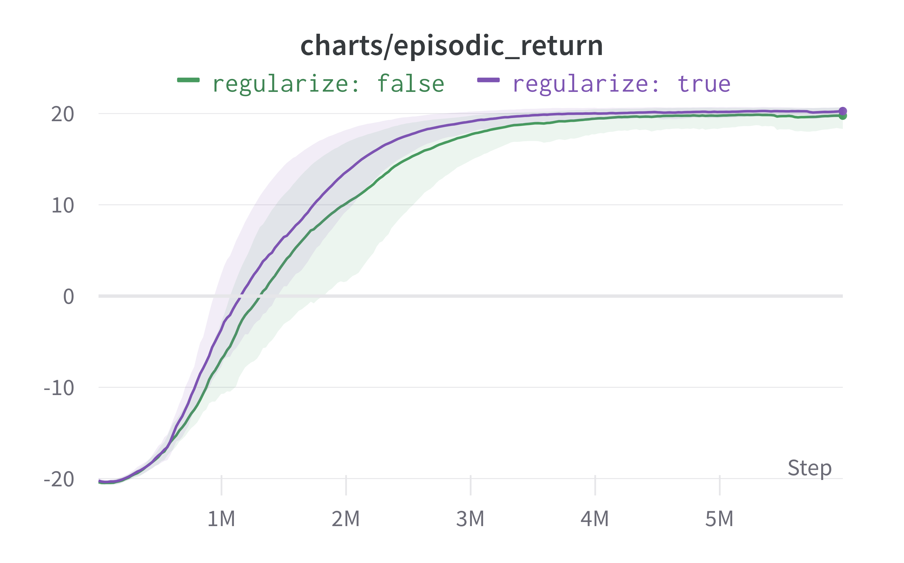
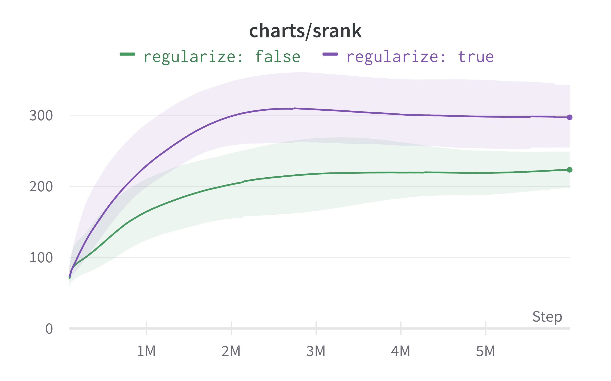
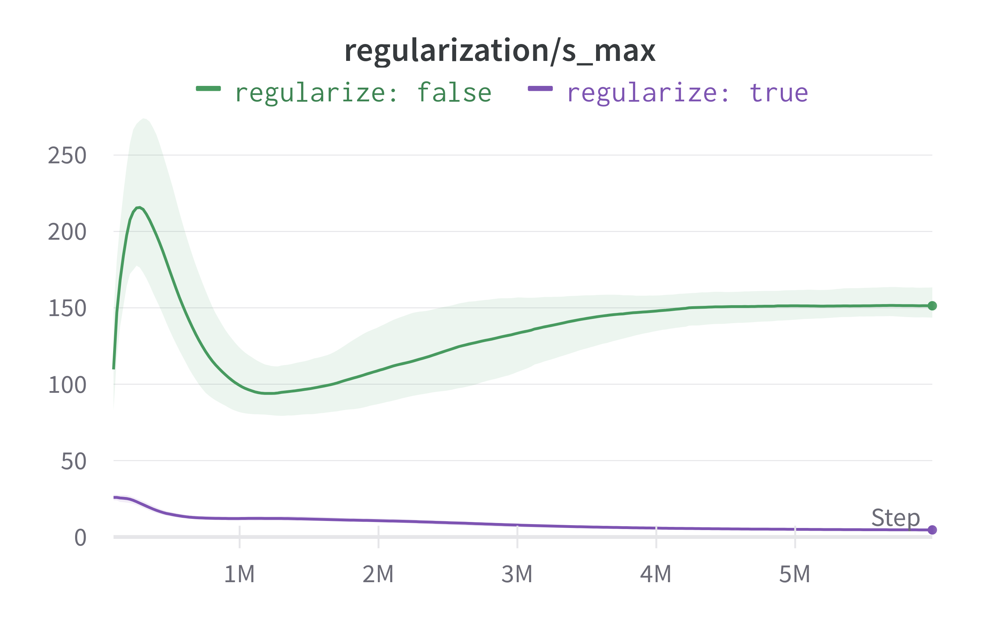
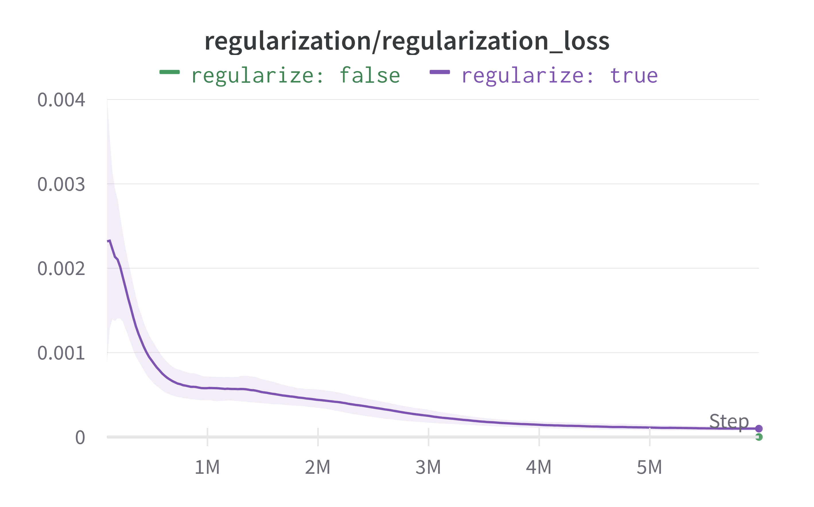

</img>

## Feature-regularized DDQN

This repository contains a Pytorch reimplementation of the feature regularization technique from the paper
[Implicit Under-Parameterization Inhibits Data-Efficient Deep Reinforcement Learning](https://openreview.net/forum?id=O9bnihsFfXU).  
The authors observe that performance plateaus/declines in value-based deep RL algorithms are linked to a collapse in effective
feature rank (defined below). This in turn is induced by an explosion of the largest singular values of the feature matrix ($\sigma^2_{\max}$).
As a regularizer, the paper proposes adding a loss term to the TD loss that penalizes large singular values $\sigma^2_{\max}$ and encourages the
smallest singular values $\sigma^2_{\min}$ to be larger:

$$
\mathcal L_p (\Phi) = \sigma^2_{\max} (\Phi) - \sigma^2_{\min} (\Phi)~.
$$

## Effective feature rank

The paper defines effective feature rank as the number of *normalized* singular values such that their sum exceeds a threshold $1-\delta$ of the sum of all singular values:

$$\text{srank}*\delta (\Phi) = \min \bigg\{ k: \frac{\sum*{i=1}^k \sigma_i (\Phi)}{\sum_{i=1}^d \sigma_i (\Phi)} \geq 1 - \delta \bigg\}~,$$

where:

- $\sigma_i (\Phi)$ represents the i-th largest singular value of the feature matrix $\Phi~.$
- $\delta$ is a threshold parameter set to $0.01$ in the paper.

## Usage

1. Install the conda environment.
2. Start a single run with `python feature_regularized_dqn.py` or a batch of runs with `feature_regularized_dqn.sh`.

## Performance

Below are the results from evaluation runs on Pong. Using the proposed regularizer leads to faster learning and a higher effective feature rank.

Episodic Return             |  Effective Rank
:-------------------------:|:-------------------------:
  |  

The authors claim that their method prevents exploding singular values of the feature matrix $\Phi~.$ Tracking the evolution of the largest and smallest singular values during training shows that the proposed regularizer indeed prevents the explosion of the largest singular values.

Evolution of largest singular value |  Evolution of smallest singular value
:-------------------------:|:-------------------------:
  |  

### Effect of the reguarlization coefficient

DQN is very sensitive to the regularization coefficient $\alpha$ for the penalty term $\mathcal L_p (\Phi)~.$ The value of $\alpha=0.001$ proposed in the paper lead to a complete collapse in learning in some runs for me. This was caused by the regularization term enforcing a degenerate feature matrix where all singular values are $0~.$ I therefore used $\alpha=0.0005$ in my experiments which yielded more stable results.

## Citations

Paper:

```bibtex
@article{kumar2020implicit,
  title={Implicit under-parameterization inhibits data-efficient deep reinforcement learning},
  author={Kumar, Aviral and Agarwal, Rishabh and Ghosh, Dibya and Levine, Sergey},
  journal={arXiv preprint arXiv:2010.14498},
  year={2020}
}
```

[cleanRL](https://github.com/vwxyzjn/cleanrl) on which the training and agent code is based:

```bibtex
@article{huang2022cleanrl,
  author  = {Shengyi Huang and Rousslan Fernand Julien Dossa and Chang Ye and Jeff Braga and Dipam Chakraborty and Kinal Mehta and João G.M. Araújo},
  title   = {CleanRL: High-quality Single-file Implementations of Deep Reinforcement Learning Algorithms},
  journal = {Journal of Machine Learning Research},
  year    = {2022},
  volume  = {23},
  number  = {274},
  pages   = {1--18},
  url     = {http://jmlr.org/papers/v23/21-1342.html}
}
```

[Stable Baselines 3](https://github.com/DLR-RM/stable-baselines3) on which the replay buffer and wrapper code is based:

```bibtex
@misc{raffin2019stable,
  title={Stable baselines3},
  author={Raffin, Antonin and Hill, Ashley and Ernestus, Maximilian and Gleave, Adam and Kanervisto, Anssi and Dormann, Noah},
  year={2019}
}
```
