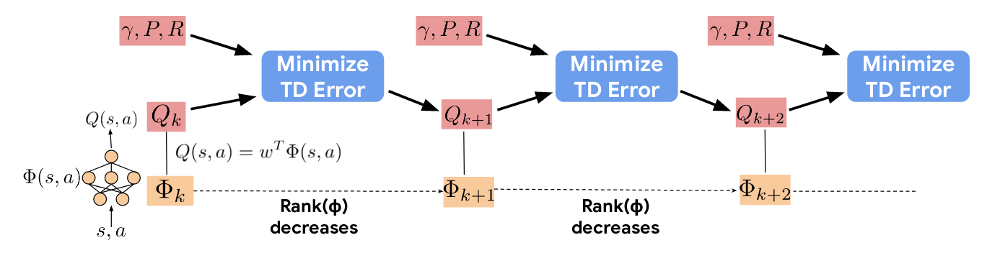

</img>

## Feature-regularized DDQN

Describe the algorithm here.

## Usage

## Performance


## Todo

- [ ] Try Huber loss/gradient clipping agent

## Citations

Paper:

```bibtex
@article{kumar2020implicit,
  title={Implicit under-parameterization inhibits data-efficient deep reinforcement learning},
  author={Kumar, Aviral and Agarwal, Rishabh and Ghosh, Dibya and Levine, Sergey},
  journal={arXiv preprint arXiv:2010.14498},
  year={2020}
}
```

[cleanRL](https://github.com/vwxyzjn/cleanrl) on which the training and agent code is based:

```bibtex
@article{huang2022cleanrl,
  author  = {Shengyi Huang and Rousslan Fernand Julien Dossa and Chang Ye and Jeff Braga and Dipam Chakraborty and Kinal Mehta and João G.M. Araújo},
  title   = {CleanRL: High-quality Single-file Implementations of Deep Reinforcement Learning Algorithms},
  journal = {Journal of Machine Learning Research},
  year    = {2022},
  volume  = {23},
  number  = {274},
  pages   = {1--18},
  url     = {http://jmlr.org/papers/v23/21-1342.html}
}
```

[Stable Baselines 3](https://github.com/DLR-RM/stable-baselines3) on which the replay buffer and wrapper code is based:

```bibtex
@misc{raffin2019stable,
  title={Stable baselines3},
  author={Raffin, Antonin and Hill, Ashley and Ernestus, Maximilian and Gleave, Adam and Kanervisto, Anssi and Dormann, Noah},
  year={2019}
}
```
